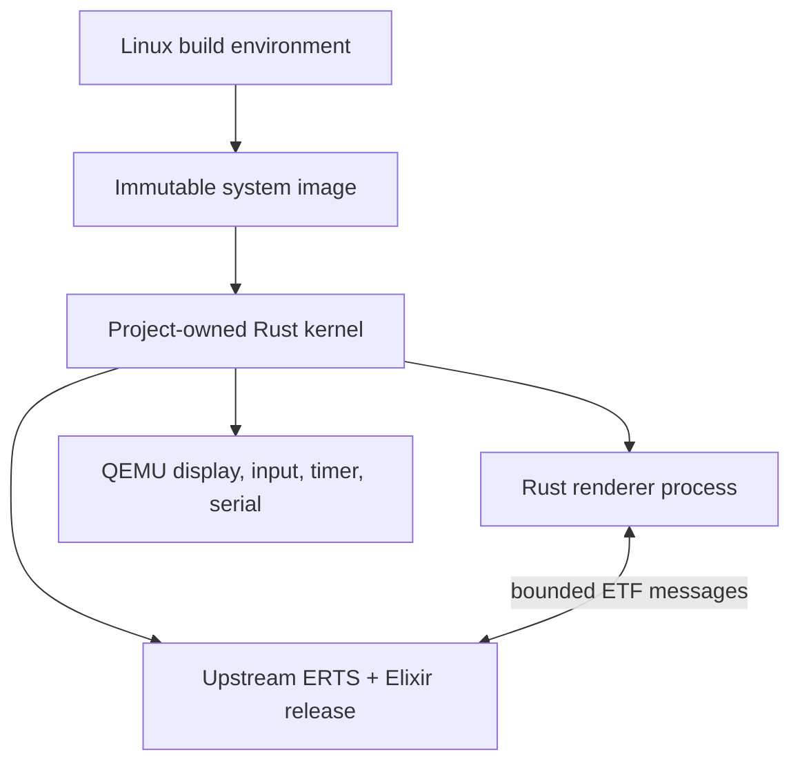
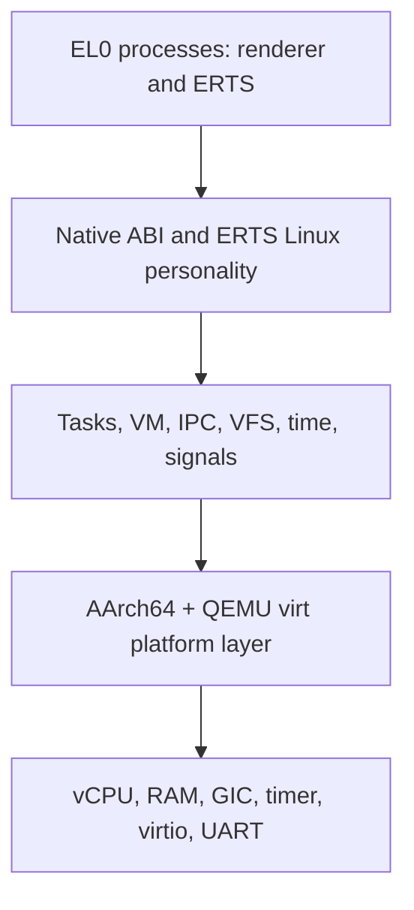
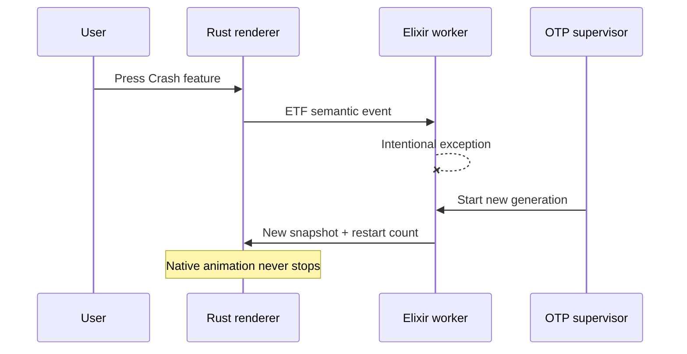
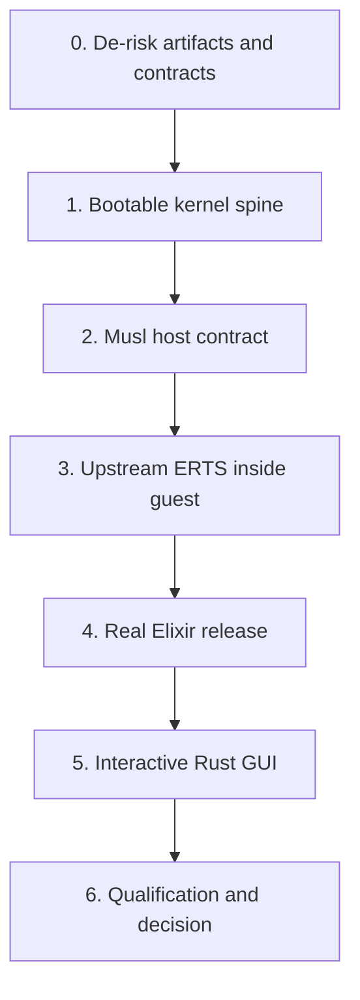

# Rust + BEAM Mobile OS: Proof-of-Concept Architecture and Validation Plan

**Status:** Audited research architecture. Phase 0 investigation is authorized.
Kernel implementation remains blocked until GATE-0 records Authorize M1.
**Date:** 2026-08-31 **Audience:** A solo builder learning systems programming
with extensive AI assistance **Target:** AArch64 QEMU `virt`, built primarily in
remote Linux VMs and run interactively on an Apple Silicon Mac

## Executive decision

This is viable as a long-term experimental OS project, and the first proof of
concept can be defined sharply enough to produce a meaningful yes/no result.

The POC should be a small, project-owned Rust kernel that boots on QEMU, runs
two isolated userspace processes, and contains no Linux or Android kernel:

1. A standard, upstream Erlang/OTP runtime executing a real Elixir Mix release.
2. A Rust GUI process that holds the exclusive display and input capabilities.

The Elixir release owns application state and behavior. The Rust process owns
rendering and remains responsive when an OTP worker crashes and is restarted.
They communicate through bounded, length-prefixed Erlang External Term Format
(ETF) messages over kernel IPC exposed to ERTS as pre-opened file descriptors.

The POC is complete only when all of that runs _inside the custom OS_. A
Linux-hosted bridge is useful during development, but it is not the result.

The most important architectural decision is to give the ERTS process a
deliberately small **AArch64 Linux-compatible syscall personality**, implemented
by the custom kernel, and statically link ERTS with musl. This does not put
Linux in the guest. It reuses a documented userspace interface so that this
experiment does not become three experiments at once: a kernel, a new libc, and
a deep ERTS port. Musl itself is built on the Linux syscall API, and its
maintainer recommends an ABI- or API-compatible syscall surface for alternate
kernels because threads are especially difficult to abstract correctly.
[Musl alternate-kernel guidance](https://www.openwall.com/lists/musl/2019/08/07/1),
[musl overview](https://musl.libc.org/)

The POC should start with the official non-JIT ERTS emulator, then prove SMP
with two BEAM scheduler threads. Disabling the JIT is a supported upstream build
choice; it avoids executable-memory and dual-mapping work before the core
hypothesis is proven. JIT support becomes a later gate, not a hidden
requirement.
[Erlang/OTP build options](https://www.erlang.org/doc/system/install.html),
[ERTS emulator options](https://www.erlang.org/doc/apps/erts/erl_cmd.html)

The expected difficulty is high. For a solo learner working part-time, this is
plausibly an 18–48 month POC rather than a weekend kernel. AI can accelerate
research, scaffolding, tests, and debugging, but it will not remove the need to
understand memory, concurrency, interrupts, ABIs, and failure evidence. There is
no reason to attach a deadline; progress should be controlled by evidence gates.

## The decision this POC must support

The POC is not meant to answer “Can an entire smartphone OS be finished?” It
should answer a smaller and more valuable question:

> Can a small custom Rust kernel host standard Erlang/OTP well enough that
> Elixir becomes a productive, fault-tolerant application personality, while
> Rust remains a safe and practical home for devices, rendering, and protected
> services?

If the answer is yes, the next investment is justified. If the answer is no, the
project should learn that before implementing networking, storage, phone
hardware, or an application ecosystem.

## Product ethos

The closest lesson to borrow from Omarchy is not its Linux package selection. It
is its willingness to be a coherent, opinionated system instead of a neutral
construction kit. Omarchy explicitly combines aesthetics and productivity,
treats coding agents as first-class tools, supports tailoring, and provides
recovery paths when customization goes wrong.
[Omarchy welcome](https://github.com/basecamp/omarchy/blob/quattro/manual/01-welcome-to-omarchy.md),
[Omarchy AI](https://github.com/basecamp/omarchy/blob/quattro/manual/17-ai.md),
[Omarchy tweaks and recovery](https://github.com/basecamp/omarchy/blob/quattro/manual/42-common-tweaks.md)

For this project, that spirit becomes:

- An opinionated reference system, not a compatibility clone of Android or iOS.
- A beautiful and coherent shell, even while the supported surface is tiny.
- AI-first _development_: clear manifests, schemas, invariants, tests, and
  rebuildable images.
- Build-time customization. An agent changes source or a system manifest, tests
  it, and produces a new image; it does not mutate the live OS.
- Recoverability. Images are reproducible and replaceable; later phases can add
  A/B boot slots and rollback.
- Escape hatches. Elixir is the fast, expressive application layer; Rust is
  available when a feature needs stronger isolation, deterministic resource use,
  or hardware access.

## Fixed constraints

| Area             | POC requirement                                                                                     |
| ---------------- | --------------------------------------------------------------------------------------------------- |
| Kernel           | Project-owned Rust kernel; do not build on Linux, Android, Redox, or another existing kernel        |
| Reuse            | Reuse focused crates, QEMU, musl, upstream OTP, Elixir, and build tools                             |
| CPU              | AArch64                                                                                             |
| Virtual machine  | QEMU `virt`                                                                                         |
| Build hosts      | Reproducible Linux build environment; x86_64 or AArch64                                             |
| Interactive host | Apple Silicon Mac, preferably QEMU with HVF acceleration                                            |
| BEAM             | Standard upstream Erlang/OTP, capable of booting a real Elixir Mix release                          |
| Runtime profile  | Interpreter first; SMP required by final acceptance                                                 |
| GUI              | One interactive proof: Rust-rendered, Elixir-controlled, pointer input, visible supervised recovery |
| AI model         | Build-time assistance and image composition; no resident OS-modifying agent                         |
| Schedule         | No deadline; phase gates determine progress                                                         |

## Explicit non-goals

The following are outside this POC:

- Android application compatibility.
- A browser, web runtime, Java/Kotlin runtime, or general app store.
- Cellular modem, calls, SMS, camera, audio, sensors, suspend/resume, battery
  management, or real phone boot chains.
- Networking, persistent writable storage, package installation, OTA updates, or
  multi-user support.
- A general POSIX or Linux-compatible operating system.
- Dynamic linking, general `fork`/`exec`, arbitrary native extensions, or
  third-party NIFs.
- A production security claim, secure boot, sandbox policy UI, or cryptographic
  update chain.
- On-device compilation or an agent that rewrites the running system.
- Daily-driver usability.

These exclusions are not cosmetic. They protect the experiment from answering
the wrong question.

## Research basis

This plan was distilled from 454 returned Exa search results across eight
workstreams, with duplication removed and conclusions restricted to primary
documentation, specifications, repositories, and source code.

Key findings:

- Upstream OTP supports cross-compilation, target sysroots, minimal
  installations, and a build without JIT. Its Unix runtime layer visibly depends
  on threads, signals, descriptors, page-size discovery, time, memory mapping,
  and polling.
  [OTP cross-compilation](https://www.erlang.org/doc/system/install-cross.html),
  [OTP Unix system layer](https://github.com/erlang/otp/blob/master/erts/emulator/sys/unix/sys.c)
- A minimal OTP release still includes ERTS, `kernel`, and `stdlib`; an Elixir
  Mix release normally includes a target-specific ERTS and must match its target
  environment. Mix does not advertise general cross-release assembly, so release
  pairing is an early risk to test.
  [OTP release structure](https://www.erlang.org/doc/system/release_structure.html),
  [Mix releases](https://hexdocs.pm/mix/main/Mix.Tasks.Release.html)
- ERTS supports ports over already-open file descriptors using `{fd, In, Out}`.
  Ports support one-, two-, or four-byte packet framing, and ETF is the
  runtime's specified binary term format. This provides a clean boundary without
  a NIF or process spawning.
  [Erlang `open_port/2`](https://www.erlang.org/doc/apps/erts/erlang.html),
  [ports](https://www.erlang.org/doc/system/ports.html),
  [ETF specification](https://www.erlang.org/doc/apps/erts/erl_ext_dist.html)
- QEMU's AArch64 `virt` board is intended for virtual guests, supplies a device
  tree, GIC, generic peripherals, PCI, and virtio transports. QEMU supports HVF
  on Arm macOS and TCG across host architectures.
  [QEMU Arm `virt`](https://www.qemu.org/docs/master/system/arm/virt.html),
  [QEMU system emulation](https://www.qemu.org/docs/master/system/introduction.html)
- Rust has a built-in tier-2 `aarch64-unknown-none` bare-metal target with
  `core` and `alloc`. The `virtio-drivers` crate is `no_std` and supports GPU,
  input, block, console, MMIO, and PCI transports.
  [Rust AArch64 bare-metal target](https://doc.rust-lang.org/rustc/platform-support/aarch64-unknown-none.html),
  [`virtio-drivers`](https://github.com/rcore-os/virtio-drivers)
- Slint exposes a custom platform interface and software renderer for `no_std`
  environments, including direct framebuffer rendering and input dispatch. It is
  a strong POC candidate, but its open-source framework license is GPLv3, so it
  must remain replaceable and its license choice must be recorded.
  [Slint bare-metal guide](https://docs.slint.dev/latest/docs/rust/slint/docs/mcu/),
  [Slint license](https://github.com/slint-ui/slint/blob/master/LICENSE.md)
- GRiSP proves that full Erlang and Elixir can boot directly on RTEMS, but its
  toolchain and OTP patches also demonstrate that this is real porting work, not
  simply compiling a crate. It is precedent for feasibility, not evidence that
  the custom-kernel route is easy.
  [GRiSP software](https://www.grisp.org/software),
  [GRiSP runtime repository](https://github.com/grisp/grisp)

## Hypotheses and falsification rules

The project should maintain these as a living table. A hypothesis is not “green”
because a demo once appeared; it needs repeatable evidence.

| ID  | Hypothesis                                                                       | Pass evidence                                                                                                                                                                                             | Stop, pivot, or investigate if…                                                                                                                         |
| --- | -------------------------------------------------------------------------------- | --------------------------------------------------------------------------------------------------------------------------------------------------------------------------------------------------------- | ------------------------------------------------------------------------------------------------------------------------------------------------------- |
| H1  | Upstream OTP with a sealed host-adapter build option has a bounded host contract | Digest-pinned `beam.smp` boots repeatedly; any source deviation is confined to `erts/emulator/sys/unix/` OS glue and changes no scheduler, GC, loader, process, code-loading, or BEAM execution semantics | Correctness requires changes outside the sealed OS adapter or semantic ERTS runtime changes rather than build configuration or OS glue                  |
| H2  | The contract can be implemented without recreating Linux                         | Required calls remain a tested subset centered on threads, VM, time, signals, files, and polling; helper process creation and network data paths are absent                                               | Boot requires general process creation, a network data path, dynamic loading, broad `/proc` or device emulation, or artifact-specific success emulation |
| H3  | Rust and BEAM interoperate cleanly                                               | Versioned, bounded, bidirectional IPC survives load, disconnects, malformed frames, and restarts                                                                                                          | The boundary routinely blocks schedulers, leaks memory, loses important events, or requires unsafe NIFs                                                 |
| H4  | The split produces useful fault containment                                      | Rust animation/input continues while an OTP worker crashes and supervision visibly restores service                                                                                                       | A normal Elixir fault freezes the renderer, corrupts the channel, or destabilizes ERTS/kernel state                                                     |
| H5  | The architecture is productive for generated features                            | Two controlled AI-assisted feature exercises are small, understandable, testable, and mostly above the kernel                                                                                             | Ordinary features repeatedly require kernel edits or sprawling cross-language coordination                                                              |
| H6  | The design points toward mobile rather than only QEMU                            | AArch64, FDT discovery, platform isolation, device interfaces, and no x86 assumptions are enforced                                                                                                        | QEMU addresses, devices, or host bridges leak through core kernel and application code                                                                  |

H1 and H2 are the kill gates. They must be investigated before a large GUI
effort.

## Definition of the completed POC

The final artifact is a bootable image and reproducible source tree with the
following demonstration:

1.  QEMU directly boots the custom Rust kernel; no Linux kernel or existing
    guest OS is present.
2.  The kernel initializes AArch64 exception handling, virtual memory,
    interrupts, timers, multiple CPUs, serial, GPU, and pointer input.
3.  It loads a Rust renderer and statically linked upstream `beam.smp` into
    separate EL0 address spaces from a read-only image.
4.  ERTS boots with at least two normal schedulers and starts a genuine
    Mix-generated Elixir release.
5.  The Rust renderer shows an opinionated “Runtime Lab” screen with a native
    animation, BEAM connection state, dynamic cards, a counter, and restart
    metrics.
6.  Pointer input crosses Rust → kernel IPC → ERTS port → Elixir.
7.  Elixir updates application state and sends a new view model back to Rust.
8.  Pressing **Crash feature** deliberately raises in a supervised Elixir
    worker. The screen shows the failure, a new worker generation, and a restart
    count while the native animation continues.
9.  A stress action exercises process spawning, timers, binaries, and garbage
    collection without freezing input.
10. Automated runs produce serial logs, measurements, screenshots, and an
    explicit pass/fail report.

The POC is not complete if ERTS or Elixir is still running on the host.

## Architecture principles

1. **Prove one unknown at a time.** Validate the ERTS artifact and ABI on Linux
   before debugging it on the new kernel.
2. **Keep upstream software upstream.** A POC that works only after changing
   BEAM semantics has disproved the intended approach.
3. **Use compatibility at the edge, not as the architecture.** Only ERTS sees
   the Linux-shaped ABI. New Rust services use a small native handle/capability
   API.
4. **Separate policy from mechanism.** Elixir owns application policy and state;
   Rust owns mechanisms that require hardware access, isolation, or
   deterministic execution.
5. **No NIFs in the proof.** NIF code executes inside ERTS and a defect can take
   down the VM. A port-like process boundary is the hypothesis worth testing.
   [Erlang NIF guidance](https://www.erlang.org/doc/system/nif.html)
6. **Static and read-only first.** No dynamic linker, installer, mutable root
   filesystem, or package manager.
7. **Unknown behavior fails loudly.** An unimplemented syscall returns `ENOSYS`
   and emits a structured trace; it is never silently approximated unless the
   contract marks that approximation safe.
8. **Make the system legible to humans and agents.** Interfaces have schemas,
   invariants, examples, negative tests, and ownership boundaries.

## System topology



The horizontal split is intentional:

| Domain                               | Rust/kernel side                 | BEAM/Elixir side                   |
| ------------------------------------ | -------------------------------- | ---------------------------------- |
| CPU and memory protection            | Owns                             | Consumes through compatibility ABI |
| Drivers and framebuffer              | Owns                             | No direct access                   |
| Input normalization                  | Owns                             | Receives semantic events           |
| Rendering and frame cadence          | Owns                             | Supplies state/view model          |
| Feature behavior                     | Exposes capabilities             | Owns                               |
| Concurrency and recovery within apps | Kernel threads/services          | OTP processes and supervision      |
| Failure reporting                    | Kernel trace and renderer status | Logger, telemetry, restart events  |
| Image composition                    | Rust build tooling               | Mix release payload                |

## Platform decision: AArch64 QEMU `virt`

### Why AArch64 first

- It matches the architecture family of modern phones.
- It runs with hardware acceleration on Apple Silicon through QEMU/HVF.
- Rust provides a built-in bare-metal target and upstream ERTS supports AArch64.
- QEMU `virt` supplies a device tree and standardized virtual devices instead of
  imitating one phone board.
- Remote x86 Linux VMs can cross-build and execute headless tests with TCG. If
  an AArch64 Linux runner is available, it can use KVM.

### Boot profile

- QEMU directly loads a raw AArch64 kernel image; no UEFI is required in the
  POC.
- Early assembly normalizes the entry exception level and enters Rust at EL1.
- The DTB address provided by QEMU is parsed; device locations are not spread
  through the kernel as constants.
- The read-only system archive is supplied as an initrd or linked image section.
  Choose the simpler method during the Phase 0 boot spike and document it as an
  ADR.
- Initial memory: 512 MiB; initial CPUs: four.
- CI: serial-only, no display backend, deterministic test seed.
- Interactive Mac: `-accel hvf`, a display backend, pointer input, and QMP
  control.

### Display transport decision

The preferred POC path is virtio GPU 2D plus virtio input, using the
`virtio-drivers` crate. The exact bus transport is an early experiment:

1. Try MMIO devices because the implementation surface is smaller.
2. Run the same bare-metal probe under Linux/TCG and macOS/HVF.
3. If MMIO graphics is unreliable with acceleration, use virtio PCI through
   QEMU's ECAM host bridge. QEMU recommends `virtio-gpu-pci` for accelerated Arm
   guests.
   [QEMU virtio GPU](https://www.qemu.org/docs/master/system/devices/virtio/virtio-gpu.html)

This choice must be settled before the kernel GUI work. It should not be
discovered after ERTS boots.

## Kernel model

Use a small monolithic kernel with isolated userspace processes. A microkernel
would be intellectually attractive, but it adds IPC, driver-domain, and
lifecycle complexity before the BEAM experiment can be evaluated.

The kernel is still structured around explicit internal interfaces so components
can migrate into services later.



### Kernel subsystems

| Subsystem     | POC responsibility                                                   | Important exclusions                 |
| ------------- | -------------------------------------------------------------------- | ------------------------------------ |
| Boot/platform | EL transition, DTB, CPU discovery, PSCI startup                      | UEFI and phone boot loaders          |
| Exceptions    | Vectors, synchronous faults, IRQs, user returns                      | Full debugger in guest               |
| Memory        | Physical pages, kernel heap, user address spaces, VMAs, page tables  | Swap, overcommit, copy-on-write      |
| Tasks         | Processes, native threads, context switching, TLS, preemption        | Users, sessions, job control         |
| SMP           | Four vCPUs, timer preemption, wakeups, simple fair scheduling        | NUMA and production scheduler policy |
| IPC           | Bounded byte streams, readiness, closure, pre-opened handles         | Networking and distributed IPC       |
| Handles/fds   | Per-process tables, rights, nonblocking mode, polling                | General Unix device model            |
| VFS           | Read-only archive, directories, release files, pseudo devices        | Writable filesystem and block cache  |
| Signals       | Minimum correct thread/process semantics needed by musl/ERTS         | Complete POSIX signal feature set    |
| ELF           | Static AArch64 executable loading, TLS, initial stack and aux vector | Dynamic loader and shared libraries  |
| Time          | Monotonic clock, sleep/timers, basic wall clock                      | Time zones and synchronization       |
| Random        | Kernel RNG interface seeded by virtio RNG                            | Production entropy certification     |
| Devices       | UART, GIC, generic timer, GPU, pointer input, poweroff               | Real hardware drivers                |
| Diagnostics   | Structured serial log, trace ring, panic frame, counters             | Production telemetry backend         |

### Task and scheduling model

ERTS performs its own lightweight process scheduling, but its scheduler threads
are ordinary OS threads. The kernel therefore needs a correct native thread
implementation, not merely cooperative tasks.

Bring-up order:

1. One CPU, one kernel thread, timer interrupts.
2. EL0 process and syscall transitions.
3. Preemptive tasks with blocking wait queues.
4. Thread-local storage via `TPIDR_EL0` on context switch.
5. Secondary CPUs and a simple global or per-CPU run queue.
6. Futex wake/wait and timed waits.
7. Final ERTS profile: `+S 2:2 +SDcpu 1:1 +SDio 1 +A 1`.

OTP's current runtime always has more native threads than its normal scheduler
count: async, dirty, auxiliary, and I/O work exist too. The final test must
inspect the actual created thread set rather than assume “two schedulers” means
two kernel tasks.
[ERTS scheduler flags](https://www.erlang.org/doc/apps/erts/erl_cmd.html)

## The two userspace ABIs

### Native Rust service ABI

New Rust processes use a compact, project-owned ABI based on typed handles and
explicit rights:

- `handle_read` / `handle_write`
- `handle_wait`
- `vm_map` / `vm_unmap`
- `thread_spawn` / `thread_exit`
- `clock_now` / `sleep_until`
- `log_write`
- `process_exit`

At image-build time, the renderer receives only the handles declared in its
manifest: display, input, the BEAM channel, log, clock, and read-only assets.

### ERTS Linux-compatible personality

ERTS is statically linked against musl and enters through the AArch64 Linux
syscall convention. The custom kernel translates only the calls and flags
admitted by `abi/beam-host.yaml`.

This personality is a compatibility adapter over native kernel objects. It must
not become the preferred API for new services.

Expected contract families—not a promise that every listed call is required—are:

| Family                  | Likely semantics                                                                          |
| ----------------------- | ----------------------------------------------------------------------------------------- |
| Process/thread identity | `getpid`, `gettid`, `exit`, `exit_group`, `set_tid_address`, robust-list support          |
| Threads                 | `clone` flags used by musl, TLS setup, child-TID clear/wake                               |
| Synchronization         | Futex wait, wake, bitset/timed forms actually observed                                    |
| Virtual memory          | `brk`, anonymous/file `mmap`, `mprotect`, `munmap`, selected `madvise`                    |
| Signals                 | `rt_sigaction`, masks, thread-directed delivery, alt stack, return frame                  |
| Files                   | `openat`, `read`, `write`, vector I/O, `close`, seek, stat, directory reads, path queries |
| Descriptor control      | `fcntl`, minimal `ioctl`, pipes, nonblocking readiness                                    |
| Polling                 | Prefer `poll`/`ppoll`; build ERTS without kernel poll initially                           |
| Time                    | `clock_gettime`, nanosleep, timers needed by the runtime                                  |
| System queries          | page size/auxv, affinity or CPU count, limits, `uname`, randomness                        |

Musl's thread implementation makes the hard part concrete: `pthread_create` uses
anonymous mappings, guard protection, `clone`, TLS, signal masks, futexes, and
child-TID behavior. These semantics need dedicated conformance tests before ERTS
is blamed for a crash.
[musl `pthread_create`](https://git.musl-libc.org/cgit/musl/tree/src/thread/pthread_create.c),
[musl AArch64 clone](https://git.musl-libc.org/cgit/musl/tree/src/thread/aarch64/clone.s)

### Host-contract discovery

Do not begin with a syscall checklist copied from another unikernel. Generate a
contract for the exact pinned runtime and workload:

1. Build the exact AArch64-musl ERTS candidate.
2. Run it on an ordinary AArch64 Linux reference environment with the exact
   Elixir release.
3. Record guest syscalls during boot, GUI protocol traffic, process stress, GC,
   supervised crashes, and clean shutdown.
4. Cross-check traces against ERTS's Unix source and musl's call sites.
5. Record each syscall number, accepted flags, return behavior, blocking
   behavior, error cases, and the test proving it.
6. Make the kernel reject unknown calls with `ENOSYS` and a structured event.

The contract file is executable documentation. A conceptual entry looks like:

```yaml
- syscall: futex
  operations: [wait_private, wake_private]
  callers: [musl-pthread, erts]
  semantics:
    alignment: 4
    timeout_clock: monotonic
    spurious_wakeup: permitted
  tests:
    - musl_mutex_contention
    - erts_scheduler_stress
  evidence:
    - traces/otp-29.0.5/boot.jsonl
```

The number of syscalls matters less than semantic depth. Twenty subtly wrong
thread and signal calls are worse than sixty trivial query calls.

## ERTS and Elixir build profile

Freeze the toolchain in an ADR and lockfile. As of this plan, OTP 29.0.5 and
Elixir 1.20.4 are reasonable spike candidates, but the project should select one
exact, experimentally verified pair and stop tracking latest until the POC
passes. [OTP releases](https://github.com/erlang/otp/releases),
[Elixir releases](https://github.com/elixir-lang/elixir/releases)

### ERTS candidate profile

- Upstream release tag with a recorded source hash.
- Cross-compile with an `aarch64-linux-musl` toolchain.
- Static executable; no dynamic linker.
- JIT disabled.
- Kernel poll disabled so the portable poll path is exercised.
- No `wx`, Java, ODBC, OpenSSL/crypto, SSH, or other applications not required
  by the demo.
- No dynamic NIFs or drivers.
- Minimal installation assembled on the build host with the upstream
  cross-install flow.
- Saved compile timestamps disabled for reproducibility.
- SMP remains enabled; early smoke tests may run one scheduler, final tests may
  not.

The exact configure flags are a build-spike output, not something to guess in
the architecture document. Store the successful command, compiler versions,
generated configuration, and patch set as a build receipt.

### Upstream-diff budget

Acceptance requires:

- No changes in BEAM instruction execution, scheduler algorithms, garbage
  collection, process semantics, or code loading.
- Prefer zero OTP source patches.
- If a patch is unavoidable, it may be confined to build detection or a new OS
  adapter and must be small, explained, and suitable for upstream discussion.
- Any change to “make the demo work” by bypassing normal OTP startup fails the
  gate.

### Mix release assembly

Mix releases are architecture/OS-sensitive primarily because ERTS and native
dependencies are target-specific. The POC release must contain no application
NIFs.

Test this path in Phase 0:

1. Compile the Elixir application on the Linux builder using the exact
   OTP/Elixir pair.
2. Generate a real Mix release with `include_erts: false` or point
   `include_erts` at the staged custom ERTS if Mix accepts it cleanly.
3. Pair the release payload with the exact custom ERTS in the system image.
4. Generate a launcher manifest containing `ROOTDIR`, boot script, config, code
   paths, VM flags, and arguments.
5. Have the kernel image loader start `beam.smp` directly, avoiding a shell and
   general `exec`.

If Mix cannot assemble a valid payload this way, stop and solve release
construction before writing more kernel. The result must still be Mix-generated;
manually copying a few `.beam` files does not satisfy the POC.

## Read-only system image and composition

The POC image contains:

```text
/system
  /manifest/system.toml
  /bin/renderer
  /beam/erts-<version>/bin/beam.smp
  /beam/releases/<app-version>/...
  /assets/fonts/...
  /licenses/...
  /build-receipt.json
```

`system.toml` is the beginning of the AI-first composition model. It declares
processes, artifacts, resources, handles, and limits. A build tool validates it
and emits a compact boot plan consumed by the kernel.

```toml
[[process]]
name = "renderer"
image = "/system/bin/renderer"
abi = "native-v1"
handles = ["display", "pointer", "beam-ui", "clock", "log"]
memory_limit_mib = 64

[[process]]
name = "beam"
image = "/system/beam/erts-29.0.5/bin/beam.smp"
abi = "linux-aarch64-beam-v1"
fds = { stdin = "null", stdout = "serial", stderr = "serial", ui_in = "beam-ui-rx", ui_out = "beam-ui-tx" }
memory_limit_mib = 192
```

The manifest is compiled into the image. It is not an instruction for the
running OS to download or generate code.

## Rust ↔ BEAM interoperability

### Boundary choice

Use a separate Rust process and an ERTS fd port, not a NIF:

- The kernel creates two bounded byte streams before either process starts.
- ERTS receives fixed descriptors for input and output.
- Elixir calls `Port.open({:fd, in_fd, out_fd}, [:binary, packet: 4])`.
- The renderer receives native handles to the opposite stream endpoints.
- Both sides exchange four-byte big-endian lengths followed by ETF.

This avoids `fork`/`exec`, sockets, distribution, a dynamic driver, and shared
unsafe code in ERTS.

### Protocol envelope

Keep the allowed ETF subset deliberately small: atoms from an allowlist,
integers, binaries, tuples, lists, and maps with bounded depth and size.

```text
{:hello, protocol_version, build_id, capabilities}
{:event, sequence, event_name, payload}
{:snapshot, sequence, view_model}
{:patch, sequence, changed_fields}
{:ack, sequence}
{:status, component, state, details}
{:metric, name, value, unit}
```

Protocol rules:

- Version every envelope.
- Cap frames at 64 KiB for the POC.
- Cap nesting, list length, string length, and atom set.
- Decode untrusted ETF on BEAM with safe atom behavior.
- Reject malformed or out-of-order state messages without crashing either side.
- Bound both send queues.
- Coalesce pointer motion and replace stale view patches; never silently drop
  button presses.
- Preserve the last valid view model when BEAM disconnects and visibly show the
  disconnected state.
- Include monotonic timestamps and sequence IDs so latency can be measured
  end-to-end.

Do not adopt a new, lightly used ETF crate merely because it claims `no_std`.
Either verify a mature crate against this build profile or implement the narrow
subset locally and property-test it against `term_to_binary`/`binary_to_term`.
ETF itself is the standard; a particular Rust codec is replaceable.

## Interactive GUI proof

### UI architecture

Use Slint's `no_std` software renderer behind a project-owned `UiBackend` trait.
The backend provides framebuffer access, monotonic time, redraw requests, and
normalized pointer events. Slint documents exactly this custom platform pattern,
including `MinimalSoftwareWindow`, timer updates, framebuffer rendering, and
input dispatch.
[Slint platform API](https://docs.slint.dev/latest/docs/rust/slint/platform/),
[software renderer](https://docs.slint.dev/latest/docs/rust/slint/platform/software_renderer/struct.SoftwareRenderer)

The renderer process owns:

- Drawing into the framebuffer and requesting presentation of dirty regions; the
  kernel's device layer owns virtio setup, DMA, and interrupts.
- Pointer event normalization.
- A compiled shell/chrome and theme.
- A generic list of dynamic cards and actions populated by Elixir.
- A small local animation/heartbeat independent of BEAM.
- The last valid view model and connection/error state.

Elixir owns:

- Card contents, values, enabled state, and actions.
- Counter and demo feature state.
- Worker lifecycle and generation count.
- Stress workloads.
- Mapping semantic input events to state transitions.

### “Runtime Lab” screen

The screen should contain only what proves the architecture:

- Native frame-cadence animation.
- BEAM status: connecting, ready, restarting feature, disconnected.
- Runtime identity: OTP version, Elixir version, scheduler count.
- Counter card with increment/decrement actions.
- Supervised worker card with PID/generation and **Crash feature**.
- Kernel metric card, initially uptime and free pages.
- Stress action and a small latency/frame chart or textual readout.

### Supervised failure sequence



Keep durable demo state in a sibling Elixir process so the intentionally
crashing worker does not erase the evidence. OTP supervisors are specifically
responsible for monitoring and restarting children; restart intensity should
also be tested so an infinite crash loop escalates rather than churns forever.
[OTP supervision principles](https://www.erlang.org/doc/system/sup_princ.html)

### UI toolkit license boundary

Slint's open-source option is GPLv3. That is compatible with an open-source POC,
but it is a material architectural choice:

- Keep Slint entirely in the renderer userspace process.
- Keep `UiBackend` and the Rust↔BEAM protocol toolkit-neutral.
- Record the chosen license and distribution obligations.
- If the desired project license is permissive-only, replace Slint before
  treating the UI layer as settled.

This is project planning, not legal advice.

## Observability and debugging

Observability is a Phase 1 feature, not cleanup work.

### Kernel evidence

- Structured serial records: timestamp, CPU, process, thread, subsystem, event,
  fields.
- Per-CPU trace rings readable after a failure.
- Panic report with exception class, registers, fault address, current task, and
  symbolized backtrace when possible.
- Counters for page allocation, context switches, IRQs, syscalls, futex waits,
  IPC queue depth, dropped/coalesced events, and unknown syscalls.
- QEMU GDB stub support from the first EL0 transition.

### Runtime evidence

- OTP boot milestones and system information sent to serial and renderer.
- Supervisor start/exit/restart events.
- Port queue length and protocol sequence counters.
- BEAM memory, process count, run queue, reductions, and GC counters sampled at
  a bounded rate.

### Test control

- QMP controls VM lifecycle and captures display screenshots.
- Serial sentinel records report machine-readable test completion.
- Guest poweroff uses the QEMU `virt` power-control device instead of hanging
  after a pass.
- Semihosting may accelerate the earliest TCG-only bring-up tests, but it is
  removed from acceptance runs because QEMU documents it as TCG-only and
  isolation-bypassing.
  [QEMU semihosting](https://www.qemu.org/docs/master/about/emulation.html),
  [QMP specification](https://www.qemu.org/docs/master/interop/qmp-spec.html)

## Repository structure

```text
/
  Cargo.toml
  rust-toolchain.toml
  justfile
  /kernel
    /src/arch/aarch64
    /src/platform/qemu_virt
    /src/mm
    /src/task
    /src/ipc
    /src/vfs
    /src/signal
    /src/abi/native
    /src/abi/linux_aarch64
    /src/drivers
    /src/trace
  /userspace
    /renderer
    /runtime_support
  /beam
    /runtime_lab
  /abi
    beam-host.yaml
    native-v1.md
  /protocol
    ui-etf-v1.md
    fixtures/
  /image
    system.toml
    licenses/
  /toolchain
    otp/
    elixir/
    container/
  /xtask
  /tests
    /host
    /qemu
    /musl
    /otp
    /protocol
  /docs
    architecture.md
    invariants.md
    learning-log.md
    /adr
    /evidence
  /ai
    project-skill.md
    task-template.md
```

`xtask` should own builds and image assembly. `just` supplies memorable entry
points but does not hide the commands:

```text
just check
just build-kernel
just build-otp
just build-release
just image
just run-headless
just run-gui
just test-qemu
just evidence
```

The Linux build container produces the same image used on macOS. The Mac runner
should not need the C/OTP cross toolchain; it only needs QEMU and the built
image.

## Phased implementation plan

The phases are dependency gates, not calendar promises. Each phase ends with a
reproducible artifact and a decision. Do not continue merely because the next
work is more exciting.



### Phase 0 — De-risk before building the kernel

**Purpose:** Resolve artifact, release, device, and protocol uncertainties in
environments that are easy to debug.

#### 0A. Pin and run the reference release

- Create `runtime_lab`, a tiny supervised Mix application with no Hex dependency
  that contains native code.
- Pin exact OTP, Elixir, C compiler, musl, and QEMU versions.
- Build and run it on ordinary Linux.
- Record the exact ERTS invocation, environment, boot files, opened files,
  threads, and syscalls.
- Produce `abi/beam-host.yaml` revision 0 from traces and source inspection.

#### 0B. Cross-build the target ERTS

- Produce a static AArch64-musl non-JIT `beam.smp` from an upstream tag.
- Run it on AArch64 Linux, or under a full AArch64 Linux VM, using the final
  intended arguments.
- Prove the non-JIT emulator runs the reference Erlang and Elixir workload.
- Capture its source hash, generated config, executable metadata, dependencies,
  and size.

#### 0C. Prove Mix-release pairing

- Generate the target application payload with `mix release` and no included
  host ERTS.
- Pair it with the target ERTS artifact.
- Start it without relying on an interactive shell.
- Confirm `Application.ensure_all_started/1`, a normal supervision tree, config
  loading, and clean shutdown.

#### 0D. Prove display and input on both hosts

- Build a tiny, independent `no_std` AArch64 program using the selected virtio
  crate.
- Draw a changing test pattern and cursor.
- Receive mouse/tablet clicks.
- Run it on remote Linux with TCG and local macOS with HVF.
- Decide MMIO versus PCI and record the exact QEMU commands.

#### 0E. Prove the Rust↔Elixir protocol on Linux

- Run the future renderer protocol as two normal Linux processes over pipes.
- Exercise handshake, snapshots, clicks, backpressure, disconnect, malformed
  ETF, and version mismatch.
- Property-test the Rust ETF subset against Erlang's encoder and decoder.
- Measure the complexity of adding one new event and field.

#### Phase 0 exit gate

All five spikes pass from clean builds, and the architecture has no unresolved
“we assume Mix/QEMU/musl can do this” dependency.

#### Stop or pivot here if

- A static upstream ERTS cannot be produced without runtime-semantic patches.
- A real Mix release cannot be paired with the target ERTS.
- The exact runtime immediately depends on out-of-scope features such as general
  subprocesses or dynamic libraries.
- The intended display/input device path does not work under Apple HVF and Linux
  TCG.

This is the cheapest point to learn that a Linux-based Rust/BEAM distribution
would be a better project.

### Phase 1 — Bootable kernel spine

**Purpose:** Establish the project-owned kernel, debugging loop, and one native
userspace process.

#### Deliverables

- Direct AArch64 boot on QEMU `virt`.
- Serial log and panic path.
- DTB parsing and memory map discovery.
- EL1 exception vectors and IRQ handling.
- Physical page allocator and kernel heap.
- Kernel virtual memory and user page tables.
- Generic timer, preemption, sleep queues, and one CPU.
- Static ELF loader and an EL0 “hello” process using the native ABI.
- QEMU runner, GDB attachment instructions, and headless pass/fail harness.
- Host unit and property tests for address/range, page-table, allocator, handle,
  and archive logic.

#### Exit tests

- Boot and exit 1,000 times in headless QEMU without a hang.
- User faults terminate only the test process and produce the expected fault
  record.
- Invalid user pointers cannot read or write kernel memory.
- Allocation, mapping, unmapping, and guard-page tests pass under randomized
  sequences.
- A timer-driven native process preempts correctly.

#### Learning outcomes

This phase deliberately teaches boot flow, privilege levels, MMU/page tables,
interrupts, syscalls, and the difference between a Rust language safety
guarantee and an OS protection boundary.

### Phase 2 — Musl and the BEAM host contract

**Purpose:** Implement enough correct Unix/Linux behavior to host C and pthread
code, without involving ERTS yet.

#### Bring-up order

1.  Initial userspace stack and auxiliary vector.
2.  Static musl “hello,” stdout, and process exit.
3.  Read-only VFS and path/file metadata calls.
4.  Anonymous VM, `brk`, `mmap`, `mprotect`, and `munmap`.
5.  Native threads, TLS, `clone`, exit, join, and child-TID behavior.
6.  Futex wait/wake and timed waits.
7.  Signal actions, masks, synchronous faults, alternate stack, and signal
    return.
8.  Pipes, nonblocking descriptors, and poll readiness.
9.  Multiple CPUs, scheduling, wakeups, and affinity queries.
10. Time, randomness, and remaining contract queries.

#### Conformance programs

Every family receives a tiny C test built with the same musl toolchain:

- `libc_start`, arguments, environment, TLS, `errno`.
- Allocation and mapping stress with guard pages.
- `pthread_create`, join, detach, mutex, condition variable, once, and
  thread-local storage.
- Futex contention, timeout, spurious wake, and address-unmap cases.
- Signal mask inheritance, thread-directed delivery, alternate stack, and
  synchronous fault recovery.
- Pipe capacity, blocking/nonblocking behavior, closure, and `poll` readiness.
- Concurrent file reads and directory walking.
- Monotonic time progression and sleep deadlines.

Use musl source behavior and Linux's userspace ABI documentation as the oracle
where POSIX prose is insufficient. Robust futex cleanup and thread-exit wakeups
are examples where “roughly correct” can become a rare deadlock.
[Linux robust futex ABI](https://www.kernel.org/doc/html/latest/locking/robust-futex-ABI.html)

#### Exit gate

- Every admitted entry in `beam-host.yaml` has positive, negative, concurrency,
  and error-path tests where applicable.
- The complete musl conformance subset passes for one hour under contention on
  four vCPUs.
- No unknown syscall is observed.
- Race-sensitive tests pass under randomized preemption seeds.

#### Stop or narrow if

- Correct pthreads/signals cannot be isolated into understandable primitives.
- The contract expands faster than it can be specified and tested.
- The kernel is accumulating broad Linux behavior that the exact runtime does
  not need.

### Phase 3 — Upstream ERTS inside the custom OS

**Purpose:** Cross the highest-risk gate before adding Elixir or graphics.

#### Milestones

1. Load `beam.smp`; reach its C entry point.
2. Complete ERTS pre-initialization and print the OTP release.
3. Boot `kernel` and `stdlib` in embedded, noninteractive mode.
4. Execute `-eval 'erlang:display(ok), halt().'` or equivalent boot action.
5. Load modules from the read-only release tree.
6. Exercise processes, messaging, timers, ETS, binaries, and per-process GC.
7. Run at `+S 1:1` only as a diagnostic step.
8. Pass at `+S 2:2 +SDcpu 1:1 +SDio 1 +A 1` on four vCPUs.

#### Required diagnostics

- At every boot milestone, log the last successful subsystem.
- Record every ERTS-created OS thread and its lifecycle.
- Track all syscalls and flags against the contract.
- Export a compact crash artifact containing kernel trace plus ERTS stderr.
- On a hang, QMP and GDB instructions must make all CPU/task states inspectable.

#### Exit gate

- Upstream ERTS boots successfully 100 consecutive times.
- A 12-hour runtime stress test completes without deadlock, kernel panic, ERTS
  abort, unknown syscall, or unbounded memory growth.
- Two normal scheduler threads execute real work concurrently.
- 10,000 Erlang processes can be created, exchange messages, and terminate
  within the configured memory budget.
- Repeated timers and forced GCs behave correctly.
- The upstream-diff budget is met.

At this point the central technical feasibility claim is proven, even before
Elixir and GUI work.

### Phase 4 — Real Elixir/OTP release

**Purpose:** Prove the productive application layer, normal boot semantics, and
supervision.

#### Deliverables

- Mix-generated release in the immutable system tree.
- `runtime_lab` OTP application and supervision tree.
- Direct ERTS launcher manifest—no host shell and no guest shell scripts
  required.
- Elixir logger routed to serial.
- A Rust “loopback service” process connected through the final fd-port path.
- Versioned ETF protocol implementation and fixtures.
- Visible-on-serial worker crash, supervisor restart, generation increment, and
  restart-intensity escalation.

#### Exit gate

- The release reports its application, Elixir, OTP, emulator flavor, and
  scheduler versions from inside the guest.
- The Rust loopback service and Elixir exchange 1,000,000 bounded messages
  without corruption or deadlock.
- Malformed and oversized frames are rejected while both processes remain alive.
- Closing either endpoint produces a bounded, observable failure and recovery
  state.
- The Elixir worker survives 1,000 intentional crash/restart cycles; an
  intentional crash storm trips supervisor intensity as designed.

### Phase 5 — Interactive GUI proof

**Purpose:** Produce the human-visible vertical slice and test whether the
architecture feels worth extending.

#### Deliverables

- Rust renderer process with a backend-independent UI interface.
- Slint software-rendered Runtime Lab screen.
- Kernel virtio GPU/input paths exposed to the renderer through its native
  capabilities.
- Dynamic Elixir-controlled cards and semantic actions.
- Native frame heartbeat independent of BEAM.
- End-to-end latency and frame-cadence telemetry.
- QMP screenshot test with stable landmarks, plus pixel-tolerant comparison if
  font rendering varies.

#### Exit gate

On the user's Apple Silicon Mac with HVF:

- Event-to-visible-update latency is below 50 ms at p95 and 100 ms at p99 during
  normal operation.
- The renderer sustains at least 30 frames per second for its local animation,
  with no pause longer than 100 ms during 100 supervised Elixir crashes.
- Pointer presses are never silently lost; pointer motion may be coalesced
  according to the protocol.
- BEAM disconnect and reconnect states are visible and do not crash the
  renderer.
- Peak guest committed memory remains within the declared 256 MiB combined
  userland budget, or any exception is measured and justified.

These are POC interaction thresholds, not product performance targets.

### Phase 6 — Qualification, productivity, and decision

**Purpose:** Test the proposition behind the architecture, not merely its
ability to render one scripted demo.

#### Reliability qualification

- 100 clean boots of the complete image.
- 12-hour mixed stress: UI input, supervised crashes, timers, process churn,
  binaries, and GC.
- 10,000 scripted UI actions with sequence accounting.
- Zero unknown syscalls and zero unclassified kernel faults.
- Stable memory after warm-up; no monotonic leak across restart cycles.
- Two clean builds from the same inputs produce the same image digest, excluding
  any explicitly documented nondeterministic tool output that must then be
  removed.

#### Developer exercise A: high-level feature

Give an AI agent the project skill and ask it to add a “scheduler utilization”
card using an already exposed BEAM metric.

Evaluate:

- Files and layers touched.
- Build/test cycle time.
- Whether the agent followed the protocol schema and generated fixtures.
- Whether a human can explain the change afterward.
- Whether kernel or unsafe Rust changes were unnecessary.

#### Developer exercise B: cross-boundary capability

Ask an AI agent to add one bounded kernel/Rust capability—for example a
page-pressure metric—then expose it through the renderer service to Elixir and
the screen.

Evaluate:

- ABI and permission changes are explicit in manifests.
- Negative permission tests exist.
- Protocol compatibility is maintained.
- Unsafe code remains confined and reviewed.
- The result is substantially easier than adding a comparable subsystem directly
  in the kernel UI.

#### Developer exercise C: composition

Change the reference theme and enable/disable one feature in `system.toml`,
rebuild, and boot a distinct image without touching the running guest.

Evaluate clean and incremental build times, cache behavior, build receipts, and
rollback to the previous image.

#### Final decision record

Score H1–H6 as pass, conditional, or fail with linked evidence. Move forward
only if H1–H4 pass and H5 is at least promising. H6 can remain conditional until
a second machine target exists.

## Learning track for a first-time systems builder

Do not postpone the project until all of systems programming is understood.
Learn each concept immediately before the phase that makes it observable, then
require yourself to explain the result without AI-generated wording.

| Phase | Concepts to learn just in time                                                  | Evidence that the concept is understood                                      |
| ----- | ------------------------------------------------------------------------------- | ---------------------------------------------------------------------------- |
| 0     | Cross-compilation, ELF binaries, host versus target, processes, byte protocols  | Explain every artifact in the image and decode one ETF frame by hand         |
| 1     | AArch64 privilege levels, exceptions, page tables, interrupts, context switches | Walk from reset to an EL0 syscall and diagnose an intentional page fault     |
| 2     | Syscall ABIs, virtual memory, TLS, pthreads, futexes, signals, readiness        | Explain why each concurrency test would fail under one plausible kernel bug  |
| 3     | Native threads versus BEAM processes, scheduler topology, runtime boot, GC      | Correlate an ERTS event with kernel threads, mappings, and syscalls          |
| 4     | OTP applications, releases, supervision, ports, backpressure                    | Predict and then observe the result of worker, port, and supervisor failures |
| 5     | Framebuffers, input events, render loops, dirty regions, latency                | Trace one click from QEMU input to an Elixir transition and visible pixels   |
| 6     | Reproducibility, stress design, measurement bias, architecture tradeoffs        | Defend a go/no-go decision using saved evidence rather than enthusiasm       |

The learning unit is not “read a chapter.” It is **predict → implement → break →
measure → explain**. Keep a short personal note for every unfamiliar mechanism:
what it protects, what invariant it relies on, how the test proves it, and what
remains uncertain.

## Acceptance matrix

| Requirement            | Automated evidence                                                  | Human evidence                                |
| ---------------------- | ------------------------------------------------------------------- | --------------------------------------------- |
| Own kernel             | Boot receipt and image inventory contain no guest kernel dependency | Source walkthrough of boot-to-EL0 path        |
| Standard OTP           | Pinned upstream hash, patch audit, `system_info` output             | Review of upstream diff budget                |
| Real Elixir release    | Mix build receipt and boot application list                         | Change and rebuild an Elixir feature          |
| Rust process isolation | Address-space and invalid-access tests                              | Crash renderer and inspect kernel containment |
| Rust↔BEAM IPC          | Fixture, fuzz, backpressure, and million-message tests              | Add a new protocol field                      |
| Interactive input      | Scripted pointer actions with sequence IDs                          | Click all demo actions on Mac                 |
| Supervised recovery    | 1,000 crash cycles and restart-intensity test                       | Watch animation continue during crash         |
| SMP                    | Four-vCPU task trace and two BEAM schedulers online                 | Inspect runtime dashboard                     |
| Reproducible image     | Matching clean-build digests                                        | Rebuild in a fresh remote VM                  |
| AI-first workflow      | Exercise reports and test deltas                                    | Builder can explain generated change          |

## Measurement design

Measurements should be emitted as JSON Lines with monotonic guest timestamps and
build IDs. Avoid screenshots or terminal prose as the only evidence.

### Core metrics

| Metric                              | Source                | Why it matters                          |
| ----------------------------------- | --------------------- | --------------------------------------- |
| Boot milestone times                | Kernel and ERTS       | Detects regressions and hangs           |
| Unknown syscall count               | Compatibility adapter | Reveals contract drift                  |
| Context switches and runnable tasks | Kernel                | Explains latency and scheduler problems |
| Futex wait duration and wake count  | Kernel                | Diagnoses pthread/ERTS deadlocks        |
| IPC queue depth and drops/coalesces | Both processes        | Tests backpressure semantics            |
| Event-to-render latency             | Sequence timestamps   | Measures interactive viability          |
| Frame interval and longest freeze   | Renderer              | Tests fault isolation visibly           |
| BEAM process/run-queue/GC data      | Elixir                | Correlates VM load with UI behavior     |
| Committed pages by process          | Kernel                | Finds leaks and runaway reservations    |
| Restart generation and reason       | OTP                   | Proves supervision behavior             |
| Build duration and cache hits       | `xtask`               | Tests AI-assisted iteration speed       |

Do not compare macOS/HVF and Linux/TCG performance as if they were equivalent.
Keep separate baselines per runner profile.

## Security and fault model for the POC

This is not a secure mobile OS yet, but its boundaries should point in the right
direction.

### Enforced in the POC

- EL0/EL1 separation and distinct user address spaces.
- W^X for user mappings even though JIT is disabled.
- Validated user pointers and lengths on every syscall.
- Per-process handle/fd tables.
- Bounded IPC memory and explicit closure.
- Read-only system image.
- Renderer alone receives display/input rights.
- ERTS alone receives its release tree and UI descriptors.
- No network, dynamic native code, arbitrary device nodes, or writable
  executable storage.
- Safe ETF decoding limits and fixed atoms.

### Deferred

- Cryptographic identity, image signing, verified boot, rollback protection.
- User-approved permissions and revocation.
- Kernel exploit mitigations, ASLR, stack canaries throughout, and hardened
  allocators.
- Side-channel analysis.
- Sandboxed third-party applications.
- Recovery partition and signed updates.

The Linux-compatible personality is not a grant of Linux capabilities. Calls
still act only on objects and paths provisioned to the ERTS process.

## Dependency and license policy

The kernel may reuse focused crates, but it must own its architecture and
integration. Candidate categories include:

- `aarch64-cpu` and register-definition helpers.
- An FDT parser.
- `virtio-drivers` for guest devices.
- Small data-structure, bitfield, logging, and synchronization crates where
  their invariants are understood.

Rules:

- Pin every dependency and compiler version.
- Record license, source hash, features, unsafe-code presence, and reason for
  use.
- Prefer `no_std`, auditable crates with narrow roles.
- Do not adopt an OS framework that supplies the scheduler, VM, syscall layer,
  or VFS; those are the learning project.
- Use `cargo-deny` or an equivalent policy check.
- Vendor source or produce a dependency mirror only when reproducible offline
  builds become a requirement.
- Generate an SPDX-style software bill of materials in the image.

Erlang/OTP and Elixir are Apache-2.0; musl is MIT; Slint's open-source framework
path is GPLv3. [OTP license](https://github.com/erlang/otp),
[Elixir license](https://github.com/elixir-lang/elixir/blob/main/LICENSE),
[musl license](https://git.musl-libc.org/cgit/musl/tree/COPYRIGHT)

## Risk register

| Risk                                         | Likelihood | Impact   | Early indicator                                   | Mitigation                                                 |
| -------------------------------------------- | ---------- | -------- | ------------------------------------------------- | ---------------------------------------------------------- |
| ERTS host surface expands                    | High       | Critical | New syscall families appear in basic boot         | Phase 0 contract; disable optional features; strict scope  |
| Pthread/futex/signal bug                     | High       | Critical | Rare hangs under SMP                              | Conformance suite, stress seeds, trace wait queues         |
| Mix release cannot be cross-paired           | Medium     | Critical | Release scripts assume host ERTS/OS               | Phase 0C before kernel; exact version; no NIFs             |
| OTP fork grows                               | Medium     | Critical | Fixes enter scheduler/GC/source loader            | Upstream-diff gate; Linux ABI seam                         |
| QEMU device path differs by accelerator      | Medium     | High     | GUI works only under TCG                          | Phase 0D on both hosts; MMIO/PCI decision                  |
| Software rendering is too slow               | Medium     | Medium   | Frame freezes without BEAM load                   | Small UI, dirty regions, 30-fps floor, profile             |
| Slint license conflicts with project intent  | Medium     | Medium   | Desired permissive-only distribution              | Process isolation, toolkit-neutral backend, early ADR      |
| Emulator success does not transfer           | High       | High     | QEMU assumptions leak into core code              | FDT, HAL boundary, second AArch64 target next              |
| AI-generated unsafe code is subtly wrong     | High       | Critical | Large opaque diffs or missing invariants          | Small tasks, unsafe budget, tests, human explanation       |
| Scope drifts into phone features             | High       | High     | Network/storage/hardware tasks appear pre-ERTS    | Non-goals and gate reviews                                 |
| Toolchain churn breaks builds                | High       | Medium   | Latest compiler/OTP changes output                | Pin versions and build receipts; deliberate upgrades       |
| Debugging loop is too slow                   | Medium     | High     | Hangs have no last-known event                    | Observability in Phase 1; cached artifacts; headless tests |
| Memory reservations exceed mobile goals      | Medium     | Medium   | ERTS maps or commits unexpectedly large regions   | Track mappings, tune flags only after correctness          |
| Compatibility ABI becomes public product API | Medium     | High     | New Rust services use Linux calls for convenience | Native ABI policy and review gate                          |

## AI-assisted development operating model

AI is useful here only if the project makes correctness inspectable.

### Project documents that every agent receives

- `architecture.md`: boundaries and rationale.
- `invariants.md`: memory, scheduler, handle, IPC, and signal invariants.
- Current phase specification and exit test.
- Relevant ABI/protocol schema.
- Commands for the smallest useful test.
- A map of unsafe modules and their proof obligations.
- Explicit non-goals.

### Task shape

Each task should fit this form:

```text
Goal:
Observable behavior:
Allowed modules:
Invariants that must remain true:
Tests to add first:
Commands to verify:
Evidence artifact:
Out of scope:
```

### Guardrails

- Ask the agent to explain the mechanism and expected failure modes before
  editing.
- Prefer one invariant or vertical slice per change.
- Never accept “it boots” in place of negative and concurrency tests.
- Require a human-readable explanation of every unsafe block.
- Keep architecture decisions in ADRs, not chat history.
- Treat generated comments as hypotheses until verified against primary
  documentation or source.
- Use differential tests: run codecs against Erlang, libc behavior against
  Linux, and device probes against both accelerators.
- Preserve a learning log written in the builder's own words. The goal is not
  only a binary; it is systems understanding.
- Have AI propose experiments when evidence is ambiguous instead of repeatedly
  patching symptoms.

### Changes requiring explicit human approval

- A new syscall or relaxation of syscall semantics.
- Any OTP source patch.
- A new unsafe module.
- An unbounded queue or allocation.
- A new device/resource right.
- A dependency with a new license class.
- Disabling a failing test or weakening an assertion.

## What a successful POC unlocks

A pass would demonstrate more than “Erlang can draw a button.” It would unlock
several credible directions:

1. **BEAM as an OS application personality.** Elixir applications could own
   long-lived services, workflows, state machines, and recovery without placing
   a garbage-collected runtime in the kernel.
2. **Rust as the protected substrate.** Drivers, rendering, crypto, storage, and
   resource brokers can remain isolated and strongly typed.
3. **A build-time generative system.** A user or agent can modify Elixir
   features, Rust services, UI declarations, or `system.toml`, then produce a
   whole new image with traceable inputs.
4. **An opinionated mobile computing environment.** The system can prioritize
   hacker workflows, local tools, inspectability, and coherent design instead of
   inheriting Android's application model.
5. **Fault-aware UI.** The renderer can retain a stable shell while individual
   BEAM features fail and recover.
6. **Multiple application models later.** A native Rust process, a BEAM release,
   and eventually a WASM sandbox could coexist behind explicit capabilities.
7. **Runtime upgrades as a future feature.** OTP code upgrades become
   interesting after storage, authentication, and rollback exist; they are not
   needed for the build-time POC.

It would _not_ yet prove phone readiness, acceptable battery life, hardware
support, a secure app model, or ecosystem viability.

## The next significant chunks after a pass

Do not jump directly from the demo to a PinePhone or other handset. The next
phases should each answer one new question.

### Next 1 — Portability and JIT

**Question:** Is the architecture portable and can standard high-performance
ERTS memory behavior be supported safely?

- Boot the same kernel core on a second AArch64 machine model or well-documented
  development board.
- Keep ERTS and the Elixir release unchanged.
- Enable the upstream JIT.
- Implement W^X transitions and the mapping strategy ERTS requires.
- Compare interpreter and JIT performance, memory, and new host-contract calls.

Pass only if the platform port is confined to HAL/drivers and JIT does not
weaken memory protection.

### Next 2 — Persistent composition and recovery

**Question:** Can users safely build and install customized systems?

- Add a simple block driver and robust read-only system-image format.
- Add signed build manifests, A/B image slots, boot success marking, and
  rollback.
- Keep user feature creation on the build machine.
- Rebuild and install two variants; intentionally fail one and prove rollback.

This is the phase that operationalizes the clarified AI-first vision.

### Next 3 — Capability-oriented app model

**Question:** Can more than one feature bundle coexist safely?

- Introduce multiple BEAM applications or releases only if isolation needs
  justify it.
- Define stable service capability schemas.
- Add per-process memory/CPU/IPC accounting.
- Design package metadata as build inputs, not mutable runtime packages.
- Consider WASM for untrusted generated logic while retaining Elixir for trusted
  system applications.

### Next 4 — Networking and remote development

**Question:** Does the BEAM advantage become stronger when connectivity exists?

- Add a Rust network service and a narrow socket capability.
- Decide whether ERTS receives native socket compatibility or communicates with
  the network broker over IPC.
- Test distribution only after entropy, credentials, time, and encryption are
  credible.
- Build a remote log/debug/deploy loop for emulator images.

### Next 5 — Mobile hardware reconnaissance

**Question:** Which real device offers a tractable, legally and technically
documentable path?

- Evaluate boot chain openness, display/touch, storage, USB, Wi-Fi, power,
  suspend, GPU, audio, camera, modem isolation, and firmware redistribution.
- Select a development target for documentation and upstreamability, not
  consumer polish.
- Port one subsystem at a time with a QEMU or host simulator where possible.

Only after these gates should “phone OS” replace “AArch64 experimental OS” as an
engineering claim.

## Alternatives considered

### Port ERTS directly to a unique native ABI

This is philosophically pure but experimentally poor. It requires a custom C
library or extensive `erts/emulator/sys` work at the same time as the kernel.
Consider it only after the Linux-compatible personality proves the workload and
its exact contract.

### Put BEAM in the kernel address space

This reduces process/ABI work but destroys the most interesting protection
boundary. A C runtime defect or native extension could corrupt the kernel, and
the experiment would not prove Rust/BEAM service interoperability.

### Use Nerves or embedded Linux first

This is the fastest route to a useful product and remains the fallback if the
goal shifts toward shipping. It does not answer the own-kernel hypothesis
because Nerves deliberately builds on Linux.
[Nerves overview](https://hexdocs.pm/nerves/getting-started.html)

### Use AtomVM instead of ERTS

AtomVM greatly reduces the host surface, but the user explicitly requires
standard Erlang/OTP and a real Mix release. It would answer a different
question. [AtomVM documentation](https://doc.atomvm.org/main/)

### Start on x86_64

This would accelerate some remote KVM testing but weaken the mobile direction
and make local Apple Silicon execution slower. x86_64 remains useful for
host-contract experiments, not as the guest architecture of record.

### Build a microkernel first

This makes isolation elegant but delays the only question the POC needs to
answer. Use a modular monolithic kernel now; revisit driver domains after the
process, capability, and IPC designs have evidence.

## Immediate first backlog

These are the first ten concrete tasks, in order:

1.  Create the repository skeleton, phase documents, ADR template, and
    reproducible Linux toolchain container.
2.  Create the pure-Elixir `runtime_lab` Mix application and supervision/crash
    tests on normal Linux.
3.  Pin the candidate OTP/Elixir pair and generate the first runtime/build
    receipt.
4.  Trace the reference workload and create `beam-host.yaml` revision 0.
5.  Cross-build static AArch64-musl ERTS with JIT and kernel poll disabled; run
    it on reference Linux.
6.  Prove the Mix release/target ERTS pairing and direct `beam.smp` launch.
7.  Specify ETF protocol v1 and implement Linux-hosted Elixir and Rust endpoints
    with conformance fixtures.
8.  Build the bare-metal AArch64 virtio display/input probe and test TCG plus
    HVF.
9.  Record ADRs for target, display transport, ERTS profile, UI toolkit/license,
    and release assembly.
10. Only then create the minimal Rust kernel crate, linker script, boot entry,
    serial logger, and first QEMU boot test.

The first kernel commit should therefore arrive after—not before—the riskiest
external artifacts have been proven.

## Recommended go/no-go rule

Continue beyond the POC if all of the following are true:

- Upstream ERTS runs without semantic runtime patches.
- The compatibility surface is bounded, tested, and understandable.
- SMP and long-running stress are reliable.
- Rust↔BEAM IPC remains responsive under faults and load.
- A new high-level feature is mostly Elixir/UI work, not kernel work.
- A cross-boundary feature remains explicit and manageable.
- The builder still finds the architecture enjoyable enough to sustain the much
  larger hardware journey.

Pivot to a Linux-based system if ERTS hosting consumes the project without
producing distinctive application-layer leverage. Stop entirely if the work is
no longer serving the learning or creative goal.

## Bottom line

The wild idea is technically coherent: Rust below, BEAM above, and a narrow
asynchronous boundary between them is a defensible OS architecture. The garbage
collector is not the central problem because it stays out of the kernel; the
hard problem is supplying the standard ERTS runtime with correct native
threading, virtual memory, time, signals, files, and polling semantics.

That hard problem is also what makes this a worthwhile systems-learning project.
The proposed POC attacks it directly, puts it behind early kill gates, and ends
in a demo that tests not only feasibility but the intended development
experience: use AI to change a legible system, rebuild it, and boot a coherent
new image.

The single most important next action is Phase 0, not a bootloader: build the
exact static AArch64 ERTS, generate a real Mix release, trace its host contract,
and prove the renderer protocol and QEMU device path on the two host
environments.

---

## Normative implementation-readiness corrections — 2026-08-30

These corrections supersede conflicting wording elsewhere in this plan.

### Candidate inputs and artifact closure

Current OTP, Elixir, Rust, QEMU, and musl releases are candidate inputs, not
compatibility proof. Exact tags, source hashes, compiler outputs, generated
configuration, QEMU binary digest, and release closure become frozen only after
Phase 0 probes pass.

“Static upstream ERTS” means an exact inspected AArch64-musl artifact with no
dynamic interpreter or unapproved runtime-loaded native dependency. Its ELF
type, relocations, TLS model, built-in drivers/native components, and complete
Mix-release closure are frozen in Gate 0 evidence.

### Host-contract discovery

Trace equivalence is not completeness. Contract discovery combines dynamic
traces, frozen-build source inspection, fault-injected error paths, and
generated positive, negative, and concurrency tests. Every source-visible host
interaction is exercised, proven unreachable, or retained as an explicit gate
risk.

### Versioned platform baseline

Use a versioned QEMU machine contract rather than bare `virt`, with separate
semantic profiles for Linux TCG, Linux AArch64 KVM when available, and macOS
Apple Silicon HVF. Performance and liveness conclusions are not interchangeable
across profiles. Freeze CPU, GIC, device, vCPU/RAM, page-size, VA/PA, counter,
auxv, HWCAP/HWCAP2, cache, atomic, and DTB-randomness behavior.

### Kernel foundations

M1/M2 explicitly require:

- a single-core IRQ, preemption, locking, scheduler-reentrancy, and
  exception-stack contract;
- FP/AdvSIMD context isolation;
- executable-page D/I cache publication;
- single-core TLB and ASID lifecycle;
- an AArch64 atomic and memory-ordering foundation;
- deterministic secondary-CPU and GIC bring-up;
- SMP scheduler, wakeup, and migration invariants;
- acknowledged cross-CPU TLB shootdowns.

### User-copy

The POC user-copy mechanism is address-space lifetime/read locking plus
architecture exception-fixup guarded copy sites. Approved EL1 copy faults become
`EFAULT`; partial-copy semantics are explicit; teardown, unmap, and protection
changes serialize against copies; direct kernel dereference of user pointers is
forbidden.

### Time, realtime, and entropy

Monotonic time, realtime, and entropy are separate sources. If realtime is
admitted, it uses the frozen PL031 or immutable-boot-epoch policy; it is never
fabricated from monotonic time. Deterministic profiles disable accidental QEMU
DTB randomness. Production `AT_RANDOM` and random calls use the declared entropy
source and fail closed if unavailable.

### VirtIO conformance

The pinned VirtIO layer must implement and test device status/reset, feature
negotiation and `FEATURES_OK`, `VIRTIO_F_VERSION_1`, queue and descriptor
validation, barriers and DMA ordering, interrupt acknowledgement,
timeout/error/reset, pinning/ownership, teardown, and malformed-device behavior.
Crate compilation alone is not conformance evidence.

### fd ports and bounded ETF

The standard upstream built-in fd port driver is intentionally used.
Project-specific or dynamically loaded drivers, NIFs, and native extensions
remain prohibited. Each direction has exactly one four-byte framing owner and a
frozen packet limit/busy limit. ETF decoding also enforces atom, size, depth,
arity, integer, compressed-term, trailing-byte, envelope, session, and
application-schema bounds.

### Demo state, action semantics, and telemetry

“Durable demo state” means supervisor-resilient in-memory demo state: it
survives the intentional worker restart and resets on release, BEAM, or OS
restart. The reset boundary is visible and tested.

An accepted action is durably admitted into the bounded Elixir transition path
for the current protocol session and receives exactly one terminal outcome:
applied, rejected, failed, or unresolved-by-disconnect.

Elixir is authoritative for feature/application state. Renderer and kernel are
authoritative for native telemetry and heartbeat. The renderer may compose these
namespaces for display without creating an echo loop or a second source of
truth.

### Display-surface ABI and latency

Use the versioned, double-buffered kernel-owned mapped-surface and
present-completion capability ABI defined by P5-00. The renderer receives
writable, execute-never mappings only for its current surface; the kernel
retains VirtIO, queue, DMA, scanout, reset, and reclamation authority.

The guest metric is event-to-present-completion. “Event-to-visible-pixel”
requires an explicit host observer, clock correlation, and error bound. Latency
targets remain provisional until calibrated by the frozen runner/profile.

### Qualification and canonical image

Before qualification, freeze warm-up, sampling, observation windows, exact
resource baselines, memory-slope estimator and confidence interval,
projected-growth budget, outlier/invalid-run classification, retry policy,
host-interruption policy, and first-failure preservation. No automatic retry
turns failure into pass.

Freeze one canonical qualification commit/image. AI exercises run in isolated
branches/worktrees and produce independent image/build IDs. Retained changes
require a new canonical image and rerun of affected reproducibility,
SBOM/license, and qualification evidence.

### Schedule and evidence ledger

The 18–48 month estimate is a rough, non-commitment heuristic. Re-estimate only
after Gate 1 using measured throughput, defect discovery, and runner capacity.

Maintain a machine-readable source/claim ledger with source title, URL or
repository/tag/commit, access date, hash where practical, supported claim,
source classification, consuming issue/ADR, and known limitation or
disagreement. A search-result count is not reproducible evidence.

### Correct AArch64 transition wording

Wherever this plan previously says “reset-to-EL0,” read:

> Explain the possible QEMU boot entry at EL1 or EL2, normalization into EL1,
> and the later exception return from EL1 into an isolated EL0 process.

### Authorization

Only Phase 0 evidence work is authorized. Kernel implementation remains blocked
until GATE-0 records **Authorize M1** with durable evidence and explicit human
approval.
